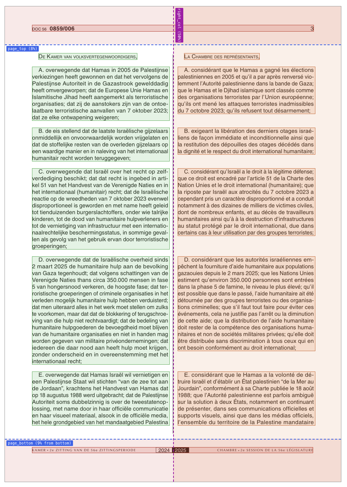

# summarizers

The summarizes take content (text, PDF files) and sends them to Mistral for LLM-based summarization.

Currently summarization is only done for Dutch text. There is not technical reason for this, just cost/time.

The following content is summarized:

**1. plenary/commission question topics (if multiple)**

Why?

The topics are often similar and contain duplicate content.

Example: `Het stempelen van eieren;De verplichte stempel op eieren in de meeste EU-lidstaten`

Summarized: `Europese eierstempelverplichtingen`

**2. plenary/commission question discussions**

Why?

Discussion are often very long. Summarization gives a quick overview.

**3. Dossier PDFS (adopted text + report)**

Why?

Dossiers are often very verbose, making it hard to know what's actually contained in them or what the pro/con points are. 

## Text summarization (`text-summarizer`)

The flow works as follows:

1. Look at original NL/FR topics/discussions
2. Send to Mistral for summarization
3. Store in `.parquet` file along with a hash of the input to avoid re-summarizing content

## PDF summarization (`pdf-summarizer`)

The flow works as follows:

1. Download relevant PDFs (looks for adopted text + report) to `cache`
2. Use the `PyMuPDF` Python library to identify relevant regions in the PDFs and convert those regions to `.md` files
3. Send the `.md` content to Mistral for summarization
4. Store the summaries (content summary + pro/contra points per party) in a `.parquet` file with a JSON structure for display on the frontend

The original PDFs are not stored in git seen as they are usually large and can easily be re-fetched from the source (`dekamer.be`). However a local-cache exists that avoids redownloading them. The extracted markdown content is checked-in in git.

This means that the PDF -> markdown extraction is run locally as well.

The sectioned PDF is shown below as an example. The header/footer is ignored as well as the French column. The sectioning can be generated for debugging purposes.

